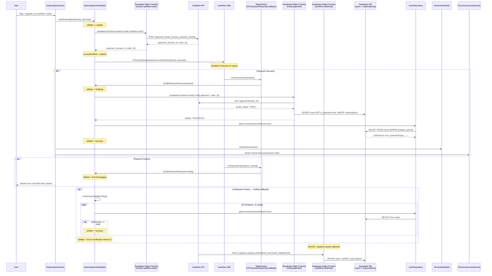
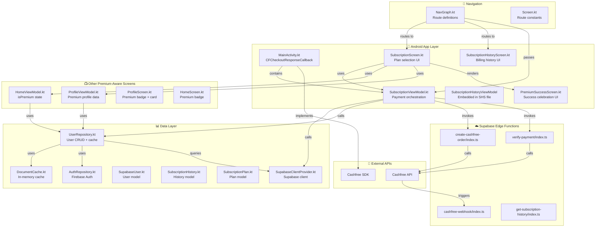
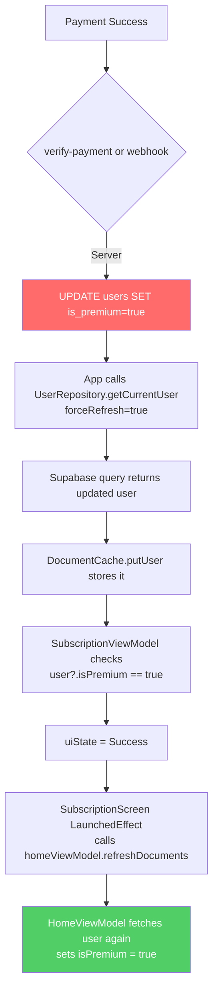
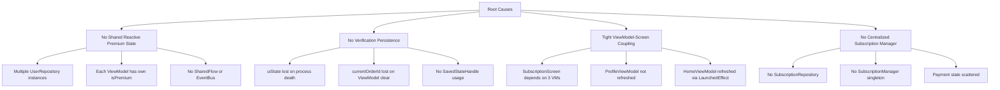

# 🔬 LOCKLET PRO — SUBSCRIPTION FLOW FORENSIC DIAGNOSTIC REPORT

**Generated**: 2026-06-17 11:45 IST  
**Scope**: Complete end-to-end subscription lifecycle audit  
**Status**: 🔴 CRITICAL ISSUES FOUND  

---

## TABLE OF CONTENTS

1. [Phase 1 — Payment Flow Mapping](#phase-1--payment-flow-mapping)
2. [Phase 2 — File Dependency Tree](#phase-2--file-dependency-tree)
3. [Phase 3 — Callback Audit](#phase-3--callback-audit)
4. [Phase 4 — Crash Analysis](#phase-4--crash-analysis)
5. [Phase 5 — Premium Activation Audit](#phase-5--premium-activation-audit)
6. [Phase 6 — UI Refresh Audit](#phase-6--ui-refresh-audit)
7. [Phase 7 — Success Screen Audit](#phase-7--success-screen-audit)
8. [Phase 8 — Failure Screen Audit](#phase-8--failure-screen-audit)
9. [Phase 9 — Webhook Audit](#phase-9--webhook-audit)
10. [Phase 10 — User Experience Audit](#phase-10--user-experience-audit)
11. [Phase 11 — Missing Features](#phase-11--missing-features)
12. [Phase 12 — Final Report](#phase-12--final-report)

---

# PHASE 1 — Payment Flow Mapping

## Complete Payment Lifecycle Diagram



## Step-by-Step Function Trace

| Step | Class | Function | File | Line |
|------|-------|----------|------|------|
| 1 | `SubscriptionScreen` | `onUpgradeClick` lambda | [SubscriptionScreen.kt](file:///d:/Antigravity%20Projects/tests/LockletPro/app/src/main/java/com/lockletpro/ui/screens/subscription/SubscriptionScreen.kt#L129-L132) | 129-132 |
| 2 | `SubscriptionViewModel` | `startSubscription()` | [SubscriptionViewModel.kt](file:///d:/Antigravity%20Projects/tests/LockletPro/app/src/main/java/com/lockletpro/viewmodel/SubscriptionViewModel.kt#L50-L102) | 50-102 |
| 3 | Supabase Edge | `create-cashfree-order` | [index.ts](file:///d:/Antigravity%20Projects/tests/LockletPro/supabase/functions/create-cashfree-order/index.ts) | 1-89 |
| 4 | `SubscriptionViewModel` | `launchCashfree()` | [SubscriptionViewModel.kt](file:///d:/Antigravity%20Projects/tests/LockletPro/app/src/main/java/com/lockletpro/viewmodel/SubscriptionViewModel.kt#L108-L147) | 108-147 |
| 5 | `MainActivity` | `onPaymentVerify()` | [MainActivity.kt](file:///d:/Antigravity%20Projects/tests/LockletPro/app/src/main/java/com/lockletpro/MainActivity.kt#L136-L143) | 136-143 |
| 6 | `MainActivity` | `onPaymentFailure()` | [MainActivity.kt](file:///d:/Antigravity%20Projects/tests/LockletPro/app/src/main/java/com/lockletpro/MainActivity.kt#L145-L153) | 145-153 |
| 7 | `SubscriptionViewModel` | `handlePaymentSuccess()` | [SubscriptionViewModel.kt](file:///d:/Antigravity%20Projects/tests/LockletPro/app/src/main/java/com/lockletpro/viewmodel/SubscriptionViewModel.kt#L153-L187) | 153-187 |
| 8 | Supabase Edge | `verify-payment` | [index.ts](file:///d:/Antigravity%20Projects/tests/LockletPro/supabase/functions/verify-payment/index.ts) | 1-145 |
| 9 | `SubscriptionViewModel` | `verifyPaymentWithPolling()` | [SubscriptionViewModel.kt](file:///d:/Antigravity%20Projects/tests/LockletPro/app/src/main/java/com/lockletpro/viewmodel/SubscriptionViewModel.kt#L204-L243) | 204-243 |
| 10 | `UserRepository` | `getCurrentUser()` | [UserRepository.kt](file:///d:/Antigravity%20Projects/tests/LockletPro/app/src/main/java/com/lockletpro/data/repository/UserRepository.kt#L59-L91) | 59-91 |
| 11 | Supabase Edge | `cashfree-webhook` | [index.ts](file:///d:/Antigravity%20Projects/tests/LockletPro/supabase/functions/cashfree-webhook/index.ts) | 1-126 |

---

# PHASE 2 — File Dependency Tree

## All Payment-Related Files



## File Inventory

| File | Purpose | Lines | Size |
|------|---------|-------|------|
| [SubscriptionViewModel.kt](file:///d:/Antigravity%20Projects/tests/LockletPro/app/src/main/java/com/lockletpro/viewmodel/SubscriptionViewModel.kt) | Payment orchestration, state machine | 247 | 7KB |
| [SubscriptionScreen.kt](file:///d:/Antigravity%20Projects/tests/LockletPro/app/src/main/java/com/lockletpro/ui/screens/subscription/SubscriptionScreen.kt) | Plan selection UI | 409 | 15KB |
| [PremiumSuccessScreen.kt](file:///d:/Antigravity%20Projects/tests/LockletPro/app/src/main/java/com/lockletpro/ui/screens/subscription/PremiumSuccessScreen.kt) | Success celebration | 475 | 16KB |
| [SubscriptionHistoryScreen.kt](file:///d:/Antigravity%20Projects/tests/LockletPro/app/src/main/java/com/lockletpro/ui/screens/subscription/SubscriptionHistoryScreen.kt) | Billing history + embedded VM | 348 | 14KB |
| [MainActivity.kt](file:///d:/Antigravity%20Projects/tests/LockletPro/app/src/main/java/com/lockletpro/MainActivity.kt) | Cashfree callback bridge | 157 | 6KB |
| [UserRepository.kt](file:///d:/Antigravity%20Projects/tests/LockletPro/app/src/main/java/com/lockletpro/data/repository/UserRepository.kt) | User data + premium state | 99 | 4KB |
| [SupabaseUser.kt](file:///d:/Antigravity%20Projects/tests/LockletPro/app/src/main/java/com/lockletpro/data/model/SupabaseUser.kt) | User data model | 32 | 737B |
| [DocumentCache.kt](file:///d:/Antigravity%20Projects/tests/LockletPro/app/src/main/java/com/lockletpro/data/cache/DocumentCache.kt) | In-memory cache (5min TTL) | 150 | 6KB |
| [HomeViewModel.kt](file:///d:/Antigravity%20Projects/tests/LockletPro/app/src/main/java/com/lockletpro/viewmodel/HomeViewModel.kt) | Home premium state | 334 | 14KB |
| [ProfileViewModel.kt](file:///d:/Antigravity%20Projects/tests/LockletPro/app/src/main/java/com/lockletpro/viewmodel/ProfileViewModel.kt) | Profile premium data | 125 | 5KB |
| [NavGraph.kt](file:///d:/Antigravity%20Projects/tests/LockletPro/app/src/main/java/com/lockletpro/ui/navigation/NavGraph.kt) | Navigation routing | 775 | 38KB |
| [create-cashfree-order/index.ts](file:///d:/Antigravity%20Projects/tests/LockletPro/supabase/functions/create-cashfree-order/index.ts) | Order creation | 89 | 2KB |
| [verify-payment/index.ts](file:///d:/Antigravity%20Projects/tests/LockletPro/supabase/functions/verify-payment/index.ts) | Payment verification | 145 | 6KB |
| [cashfree-webhook/index.ts](file:///d:/Antigravity%20Projects/tests/LockletPro/supabase/functions/cashfree-webhook/index.ts) | Async webhook handler | 126 | 5KB |

---

# PHASE 3 — Callback Audit

## Callback Chain Analysis

### 1. `onPaymentVerify` (Success Callback)
- **Location**: [MainActivity.kt:136-143](file:///d:/Antigravity%20Projects/tests/LockletPro/app/src/main/java/com/lockletpro/MainActivity.kt#L136-L143)
- **Behavior**: Delegates to `subscriptionViewModel.handlePaymentSuccess(orderId)`
- **Safety**: Wrapped in try-catch — exception is logged but **silently swallowed**

### 2. `onPaymentFailure` (Failure Callback)
- **Location**: [MainActivity.kt:145-153](file:///d:/Antigravity%20Projects/tests/LockletPro/app/src/main/java/com/lockletpro/MainActivity.kt#L145-L153)
- **Behavior**: Extracts error message, delegates to `subscriptionViewModel.handlePaymentFailure(errorMsg)`
- **Safety**: Wrapped in try-catch — exception is logged but **silently swallowed**

### 3. `handlePaymentSuccess` (Verification)
- **Location**: [SubscriptionViewModel.kt:153-187](file:///d:/Antigravity%20Projects/tests/LockletPro/app/src/main/java/com/lockletpro/viewmodel/SubscriptionViewModel.kt#L153-L187)
- **Behavior**: Calls verify-payment edge function, falls back to polling on error

### 4. `handlePaymentFailure` (Error State)
- **Location**: [SubscriptionViewModel.kt:193-198](file:///d:/Antigravity%20Projects/tests/LockletPro/app/src/main/java/com/lockletpro/viewmodel/SubscriptionViewModel.kt#L193-L198)
- **Behavior**: Sets `uiState = Error(message)`

## Critical Findings

> [!CAUTION]
> ### CAN PAYMENT SUCCESS OCCUR WITHOUT PREMIUM ACTIVATION?
> **YES** — This is possible in multiple scenarios:
>
> 1. **Verify-payment function fails** + **Polling times out** (30s window): The payment is charged but the app shows "Verification timeout". The user remains on the free plan until the webhook eventually fires.
>
> 2. **App killed during verification**: If the user force-closes the app after payment but before verification completes, `uiState` is lost. On next launch, `HomeViewModel.loadDocuments()` runs with `forceRefresh = false`, which may serve stale cached data showing `isPremium = false`.
>
> 3. **Network failure after SDK returns**: If network drops right after Cashfree returns success but before the verify-payment call, the catch block falls through to `verifyPaymentWithPolling()` which also requires network.

> [!WARNING]
> ### CAN PAYMENT SUCCESS RETURN TO APP BUT SKIP VERIFICATION?
> **YES** — If `handlePaymentSuccess()` is called but `orderId` is null (defensive check at line 162), the code skips the `verify-payment` call entirely and falls through to `verifyPaymentWithPolling()`. If `currentOrderId` is also null (line 206), the polling function returns immediately via `val orderId = currentOrderId ?: return`, setting **no error state**. The user is left in `Verifying` state forever.

> [!WARNING]
> ### CAN VERIFICATION SUCCEED BUT UI NOT UPDATE?
> **YES** — The `SubscriptionScreen` observes `subscriptionViewModel.uiState` (a `mutableStateOf`), so when it becomes `Success`, the `LaunchedEffect` at line 55-58 fires `homeViewModel.refreshDocuments()`. However:
> - `HomeViewModel` and `ProfileViewModel` are **separate instances** created via `viewModel()` default factory
> - The `ProfileViewModel` used in `SubscriptionScreen` (line 46) is only loaded once via `getUser(forceRefresh=false)` in its `init`
> - After payment success, **`profileViewModel.userProfile.premiumExpiry` may still be null** because no one calls `profileViewModel.loadUserProfile()` again

> [!WARNING]
> ### CAN NAVIGATION FAIL AFTER PAYMENT SUCCESS?
> **YES** — The `PremiumSuccessScreen` is rendered **inline** within `SubscriptionScreen` (line 108-114), not as a separate navigation destination. The `onContinue` callback is wired to `onNavigateBack`, which calls `navController.popBackStack()`. This is generally safe, but if the back stack has been modified (e.g., process death restoration), it could navigate to an unexpected screen.

---

# PHASE 4 — Crash Analysis

## Crash Risk Matrix

| # | File | Function | Line | Crash Type | Severity | Probability |
|---|------|----------|------|------------|----------|-------------|
| 1 | [SubscriptionScreen.kt](file:///d:/Antigravity%20Projects/tests/LockletPro/app/src/main/java/com/lockletpro/ui/screens/subscription/SubscriptionScreen.kt#L131) | `onUpgradeClick` | 131 | **ClassCastException** — `context as Activity` may fail if `LocalContext` is not an Activity (e.g., in preview or test) | 🔴 HIGH | Medium |
| 2 | [SubscriptionViewModel.kt](file:///d:/Antigravity%20Projects/tests/LockletPro/app/src/main/java/com/lockletpro/viewmodel/SubscriptionViewModel.kt#L80) | `startSubscription` | 80 | **JSONException** — `JSONObject(raw)` crashes if response is not valid JSON (e.g., HTML error page) | 🟡 MEDIUM | Low |
| 3 | [SubscriptionViewModel.kt](file:///d:/Antigravity%20Projects/tests/LockletPro/app/src/main/java/com/lockletpro/viewmodel/SubscriptionViewModel.kt#L206) | `verifyPaymentWithPolling` | 206 | **Silent Return** — `currentOrderId ?: return` silently exits without setting error state, leaving UI stuck in `Verifying` | 🔴 HIGH | Medium |
| 4 | [SubscriptionViewModel.kt](file:///d:/Antigravity%20Projects/tests/LockletPro/app/src/main/java/com/lockletpro/viewmodel/SubscriptionViewModel.kt#L158) | `handlePaymentSuccess` | 158 | **Coroutine Cancellation** — `viewModelScope.launch` cancels on ViewModel clear; if Activity finishes during verification, coroutine is cancelled silently | 🔴 HIGH | Medium |
| 5 | [MainActivity.kt](file:///d:/Antigravity%20Projects/tests/LockletPro/app/src/main/java/com/lockletpro/MainActivity.kt#L64) | `onCreate` | 64 | **IllegalStateException** — `CFPaymentGatewayService.getInstance()` may throw if SDK not initialized; exception is caught but callback won't be registered | 🟡 MEDIUM | Low |
| 6 | [SubscriptionViewModel.kt](file:///d:/Antigravity%20Projects/tests/LockletPro/app/src/main/java/com/lockletpro/viewmodel/SubscriptionViewModel.kt#L136-L138) | `launchCashfree` | 136-138 | **IllegalStateException** — `CFPaymentGatewayService.getInstance().doPayment()` may throw if session is invalid or already used | 🟡 MEDIUM | Low |
| 7 | [PremiumSuccessScreen.kt](file:///d:/Antigravity%20Projects/tests/LockletPro/app/src/main/java/com/lockletpro/ui/screens/subscription/PremiumSuccessScreen.kt#L184) | `PremiumGlassCard` | 184 | **DateTimeParseException** — `Instant.parse(expiryDate)` can throw for malformed dates; caught by try-catch with fallback | 🟢 LOW | Low |
| 8 | [SubscriptionHistoryScreen.kt](file:///d:/Antigravity%20Projects/tests/LockletPro/app/src/main/java/com/lockletpro/ui/screens/subscription/SubscriptionHistoryScreen.kt#L63) | `fetchHistory` | 63 | **NullPointerException** — `authRepository.getCurrentUser()?.uid ?: throw Exception(...)` — safe but user sees error if not logged in | 🟢 LOW | Very Low |
| 9 | [SubscriptionViewModel.kt](file:///d:/Antigravity%20Projects/tests/LockletPro/app/src/main/java/com/lockletpro/viewmodel/SubscriptionViewModel.kt#L34) | Class init | 34 | **Multiple UserRepository instances** — `SubscriptionViewModel` creates its own `UserRepository()` (line 34), separate from `HomeViewModel`'s instance. Cache is shared (singleton `DocumentCache`), but `Mutex` instances are per-repository, creating potential race conditions | 🟡 MEDIUM | Medium |
| 10 | [SubscriptionScreen.kt](file:///d:/Antigravity%20Projects/tests/LockletPro/app/src/main/java/com/lockletpro/ui/screens/subscription/SubscriptionScreen.kt#L112) | `PremiumSuccessScreen` | 112 | **Stale Data** — `profileViewModel.userProfile.premiumExpiry` may be null when success screen renders because ProfileViewModel hasn't refreshed yet | 🟡 MEDIUM | High |

---

# PHASE 5 — Premium Activation Audit

## Where Premium Status Is Stored

| Location | Field | Type | Purpose |
|----------|-------|------|---------|
| Supabase `users` table | `is_premium` | boolean | Server-side truth |
| Supabase `users` table | `premium_expiry` | timestamp | Expiry date |
| Supabase `users` table | `plan_type` | string | "monthly" / "yearly" |
| Supabase `users` table | `subscription_status` | string | "PREMIUM" |
| `DocumentCache` (in-memory) | `SupabaseUser.isPremium` | Boolean | Client cache (5min TTL) |
| `HomeViewModel` | `isPremium` | `mutableStateOf<Boolean>` | Compose UI state |
| `ProfileViewModel` | `userProfile.isPremium` | `Boolean` in `UserProfile` data class | Profile UI state |

## How `isPremium` Is Updated



## How Premium Badge Becomes Visible

1. **HomeScreen**: Reads `homeViewModel.isPremium` → Shows `PremiumBadge()` next to user name ([HomeScreen.kt:334-337](file:///d:/Antigravity%20Projects/tests/LockletPro/app/src/main/java/com/lockletpro/ui/screens/home/HomeScreen.kt#L334-L337))
2. **ProfileScreen**: Reads `profile.isPremium` from `ProfileViewModel` → Shows `PremiumBadge()` in hero card and `PremiumActiveCard` ([ProfileScreen.kt:212, 222, 737](file:///d:/Antigravity%20Projects/tests/LockletPro/app/src/main/java/com/lockletpro/ui/screens/profile/ProfileScreen.kt#L212))

## Premium Expiry Validation

`HomeViewModel` performs client-side expiry check:
```kotlin
val effectivePremium = supabaseUser?.isPremium == true &&
    (serverExpiry == null || runCatching { 
        Instant.parse(serverExpiry).isAfter(Instant.now()) 
    }.getOrDefault(false))
```

> [!IMPORTANT]
> ### Must the User Restart the App to See Premium?
> **NO** — But there is a **5-30 second delay**. The sequence is:
> 1. `SubscriptionViewModel.handlePaymentSuccess()` → calls `UserRepository.getCurrentUser(forceRefresh=true)` → updates cache
> 2. `SubscriptionScreen.LaunchedEffect` → calls `homeViewModel.refreshDocuments()` → fetches user again → sets `isPremium = true`
> 3. Compose recomposition occurs because `isPremium` is `mutableStateOf`
>
> However, **`ProfileViewModel` is NOT refreshed** after payment. If user navigates to Profile before HomeScreen refreshes, the premium badge may not show.

> [!WARNING]
> ### Cache Delay Risk
> `DocumentCache` has a **5-minute TTL** (`CACHE_TTL_MS = 5 * 60 * 1000L`). If user navigates to a screen that uses `getCurrentUser(forceRefresh = false)`, it may serve the stale cached non-premium user for up to 5 minutes. The explicit `forceRefresh = true` call in `handlePaymentSuccess` bypasses this, but **other ViewModels don't get this signal**.

---

# PHASE 6 — UI Refresh Audit

## Post-Payment State Refresh Chain

| Component | Refreshes? | How? | Timing |
|-----------|-----------|------|--------|
| `SubscriptionViewModel.uiState` | ✅ YES | Direct set: `uiState = SubscriptionUiState.Success` | Immediate |
| `SubscriptionScreen` recomposition | ✅ YES | Observes `subscriptionViewModel.uiState` via `mutableStateOf` | Immediate |
| `HomeViewModel.isPremium` | ✅ YES | `LaunchedEffect(uiState)` in SubscriptionScreen calls `homeViewModel.refreshDocuments()` | Delayed (network call) |
| `ProfileViewModel.userProfile` | 🔴 **NO** | No one calls `profileViewModel.loadUserProfile()` after payment success | **NEVER** (until screen recreated) |
| `UserRepository` Supabase query | ✅ YES | `forceRefresh=true` in `handlePaymentSuccess` | During verification |
| `DocumentCache` user entry | ✅ YES | `putUser()` called in `UserRepository.getCurrentUser()` after network fetch | During verification |
| Premium Badge on HomeScreen | ✅ YES | `homeViewModel.isPremium` is `mutableStateOf`, triggers recomposition | After `refreshDocuments` completes |
| Premium Badge on ProfileScreen | 🔴 **NO** | `profileViewModel` is not refreshed | Not until profile re-entered |
| PremiumSuccessScreen expiry date | 🟡 PARTIAL | Uses `profileViewModel.userProfile.premiumExpiry` which is stale | Shows null/empty on first purchase |

> [!CAUTION]
> ### Critical UI Refresh Gap
> **The `PremiumSuccessScreen` displays the premium expiry date from `profileViewModel.userProfile.premiumExpiry`** ([SubscriptionScreen.kt:112](file:///d:/Antigravity%20Projects/tests/LockletPro/app/src/main/java/com/lockletpro/ui/screens/subscription/SubscriptionScreen.kt#L112)). After a purchase, this value is **null** because `ProfileViewModel` hasn't re-fetched from Supabase. The success screen fallback shows the generic text "Your documents are now protected with advanced features" instead of the actual expiry date. This is functional but **suboptimal UX**.

---

# PHASE 7 — Success Screen Audit

## PremiumSuccessScreen Analysis

- **Location**: [PremiumSuccessScreen.kt](file:///d:/Antigravity%20Projects/tests/LockletPro/app/src/main/java/com/lockletpro/ui/screens/subscription/PremiumSuccessScreen.kt)
- **Type**: `@Composable` function (not a navigation destination)
- **Rendered by**: `SubscriptionScreen` inline (line 108-114)

### Flow Diagram

```mermaid
flowchart TD
    A[SubscriptionScreen renders] --> B{Check uiState}
    B -->|Success| C[Render PremiumSuccessScreen<br>isJustPurchased=true]
    B -->|isPremium already| D[Render PremiumSuccessScreen<br>isJustPurchased=false]
    B -->|Not premium| E[Render FreeTierView]
    
    C --> F[AnimatedGradientBackground<br>SparkleParticles<br>AnimatedCrownIcon]
    C --> G[GradientButton onClick = onNavigateBack]
    
    D --> H[StaticGradientBackground<br>StaticCrownIcon]
    D --> I[Shows "Active until {date}"]
    
    G --> J[navController.popBackStack]
    
    style C fill:#51cf66,color:white
    style D fill:#3b82f6,color:white
```

### Reachability Audit

| Question | Answer |
|----------|--------|
| Is it reachable? | ✅ YES — rendered when `uiState is SubscriptionUiState.Success` |
| Who launches it? | `SubscriptionScreen` composable, conditionally |
| When is it launched? | When verification completes and sets `uiState = Success` |
| Can success occur without opening it? | 🔴 **YES** — if app is killed during verification, the success state is lost. Webhook may activate premium later, but user never sees the success screen. |
| Can app close before reaching it? | 🔴 **YES** — if user presses home button during Verifying state. The coroutine continues in background but `uiState` changes won't be observed. |
| Can navigation stack remove it? | 🟡 **NO** — it's inline, not a separate nav destination. But if SubscriptionScreen is popped from back stack during verification, the success screen will never render. |

---

# PHASE 8 — Failure Screen Audit

## Failure Screen Analysis

There is **NO dedicated failure screen**. Failures are shown as an **inline error card** within `SubscriptionScreen`.

### Error Display Location

[SubscriptionScreen.kt:267-276](file:///d:/Antigravity%20Projects/tests/LockletPro/app/src/main/java/com/lockletpro/ui/screens/subscription/SubscriptionScreen.kt#L267-L276):

```kotlin
if (errorMessage != null) {
    Surface(color = MaterialTheme.colorScheme.errorContainer, ...) {
        Column(...) {
            Text(errorMessage, ...)
            Button(onClick = onRetry) { Text("Retry") }
        }
    }
}
```

### Failure Path Coverage

| Failure Scenario | Reaches Error UI? | Error Message |
|-----------------|-------------------|---------------|
| Failed payment (card declined) | ✅ YES | SDK error message from Cashfree |
| Cancelled payment (user backed out) | ✅ YES | "Unknown error" or SDK cancel message |
| Back pressed during payment | ✅ YES | SDK sends cancel callback |
| Network timeout during order creation | ✅ YES | "Payment failed: {timeout exception}" |
| Verification failure (server error) | ✅ YES | Falls to polling → "Verification timeout" |
| `orderId` is null in success callback | 🔴 **NO** | Falls to polling → if `currentOrderId` also null, **UI stuck in Verifying forever** |
| App kill during verification | 🔴 **NO** | State is lost — user sees SubscriptionScreen in Idle state on next launch |
| SDK launch failure | ✅ YES | "Failed to launch payment" |
| User not logged in | ✅ YES | "User not logged in" |

> [!CAUTION]
> ### Missing Failure Routes
> 1. **Null orderId with null currentOrderId**: The `verifyPaymentWithPolling()` function silently returns (line 206: `val orderId = currentOrderId ?: return`). The UI remains stuck in `Verifying` state with a spinner forever. **No timeout, no error, no recovery.**
>
> 2. **App kill during verification**: `uiState` is not persisted. If user returns, they see the default Idle state. If payment was charged, premium may eventually activate via webhook, but user has no feedback.

---

# PHASE 9 — Webhook Audit

## Webhook Architecture

### cashfree-webhook Edge Function

- **Location**: [cashfree-webhook/index.ts](file:///d:/Antigravity%20Projects/tests/LockletPro/supabase/functions/cashfree-webhook/index.ts)
- **Authentication**: HMAC-SHA256 signature verification using `CASHFREE_SECRET_KEY`
- **Event Filter**: Only processes `PAYMENT_SUCCESS_WEBHOOK` type

### Verification Logic

1. **Signature Verification** ✅ — `x-webhook-signature` + `x-webhook-timestamp` + raw body
2. **Idempotency Check** ✅ — Checks `subscriptions` table for existing `order_id` before processing
3. **User Lookup** ✅ — Extracts `firebase_uid` from `order_id` format: `ORDER_{uid}_{timestamp}`
4. **Premium Update** ✅ — Updates `users.is_premium`, `subscription_status`, `plan_type`, `premium_expiry`
5. **Subscription Insert** ✅ — Inserts record into `subscriptions` table

### Webhook vs verify-payment Comparison

| Aspect | verify-payment | cashfree-webhook |
|--------|---------------|-----------------|
| Triggered by | App (client-initiated) | Cashfree (server-initiated) |
| Authentication | None (anon key) | HMAC signature |
| Calls Cashfree API? | ✅ YES (GET order status) | ❌ NO (uses payload data) |
| Idempotency check | ✅ YES | ✅ YES |
| Both update same tables | ✅ YES | ✅ YES |
| Can create duplicates? | ❌ NO (idempotency) | ❌ NO (idempotency) |

### Critical Webhook Findings

> [!WARNING]
> ### Can webhook arrive after app returns?
> **YES** — This is expected and by design. The webhook is async. The app uses `verify-payment` for immediate verification. If that fails, it polls. If polling also fails, the webhook will eventually update the database.

> [!IMPORTANT]
> ### Can webhook activate premium later?
> **YES** — If the app's verification and polling both fail (network issues), the webhook will fire asynchronously (typically within 30 seconds) and update the `users` table. The next time the app fetches the user profile, `isPremium` will be `true`. However, the **user has no indication this happened** — they saw "Verification timeout" and may think payment failed.

> [!WARNING]
> ### Can duplicate webhook occur?
> **YES** — Cashfree may retry webhooks. The idempotency check (`existingSub` query) prevents duplicate processing. ✅ This is handled correctly.

> [!CAUTION]
> ### Can payment be successful but user remain free?
> **THEORETICALLY YES** — If:
> 1. `verify-payment` fails
> 2. Polling times out (30s)
> 3. Webhook fails (Supabase down)
> 4. `firebase_uid` extraction from `order_id` fails (malformed order_id)
>
> In practice this is very unlikely (requires multiple simultaneous failures), but there is **no manual recovery mechanism** for the user.

> [!WARNING]
> ### Race Condition Between verify-payment and webhook
> Both `verify-payment` and `cashfree-webhook` perform the same DB operations (UPDATE users, INSERT subscriptions). If they execute simultaneously, the idempotency check may not catch duplicates due to race conditions. The `subscriptions.select().eq('order_id').single()` query returns null for both if neither has inserted yet, leading to **duplicate subscription records**.
>
> **Impact**: User gets two entries in billing history for the same payment.

---

# PHASE 10 — User Experience Audit

## Screen Scores

| Screen | Loading | Animation | Feedback | Error Handling | Overall | Score |
|--------|---------|-----------|----------|----------------|---------|-------|
| **SubscriptionScreen** (Free tier) | ✅ Spinner | ✅ Pulsing glow, animated toggle | ✅ Clear pricing | ✅ Error card + retry | Beautiful premium-feel UI | **8/10** |
| **SubscriptionScreen** (Loading) | ✅ CircularProgress | ❌ No skeleton | ⚠️ Only "Creating order..." text | N/A | Functional but basic | **6/10** |
| **SubscriptionScreen** (Verifying) | ✅ CircularProgress | ❌ No verification animation | ⚠️ Only "Verifying payment..." text | N/A | No reassurance for user | **5/10** |
| **PremiumSuccessScreen** | N/A | ✅ Sparkle particles, animated gradient, bouncy entrance, shimmer button | ✅ Excellent celebration feel | N/A | Beautiful, premium feel | **9/10** |
| **SubscriptionScreen** (Error) | N/A | ❌ No animation | ✅ Error message shown | ✅ Retry button present | Functional but not friendly | **6/10** |
| **SubscriptionHistoryScreen** | ✅ Spinner | ✅ Gradient cards | ✅ Status badges | ✅ Error message | Clean and informative | **8/10** |
| **ProfileScreen** (Premium badge) | N/A | ✅ Breathing glow, shimmer sweep | ✅ Expiry date shown | N/A | Excellent premium branding | **9/10** |
| **HomeScreen** (Premium badge) | N/A | ❌ Static badge | ✅ Badge appears | N/A | Minimal but functional | **7/10** |

---

# PHASE 11 — Missing Features

## Feature Gap Analysis

| # | Missing Feature | Severity | Impact |
|---|----------------|----------|--------|
| 1 | **Failure Animation** — No animation or illustration for failed payments. Just a plain error card. | 🟡 MEDIUM | Poor UX for failed payments |
| 2 | **Verification Loading Screen** — During the `Verifying` state, only a small spinner + text is shown inside the upgrade button area. No full-screen verification experience. | 🟡 MEDIUM | User may think nothing is happening |
| 3 | **Retry Verification** — The retry button resets state to `Idle`, forcing user to re-initiate the entire payment instead of retrying just the verification step | 🔴 HIGH | User charged again for a retry |
| 4 | **Restore Premium State** — No "Restore Purchase" button for users who reinstall or switch devices. Premium state depends entirely on server-side status which is fetched on login, so it works — but there's no explicit "Restore" flow for user confidence. | 🟡 MEDIUM | User anxiety after reinstall |
| 5 | **Offline Handling** — No specific handling for starting a subscription while offline. The Supabase call will fail with a generic error. | 🟡 MEDIUM | Confusing error message |
| 6 | **Payment Pending State** — Cashfree can return orders in `ACTIVE` (not yet paid) status. The `verify-payment` function returns `{ status: data.order_status }` which could be "ACTIVE". The app doesn't handle this state. | 🟡 MEDIUM | User confusion |
| 7 | **Duplicate Payment Protection** — No guard against user tapping "Upgrade" multiple times during the Loading state. The clickable is disabled for non-Idle states (line 287: `if (uiState is SubscriptionUiState.Idle) onUpgradeClick()`), but there's no debounce or lock. | 🟢 LOW | SDK prevents double launch |
| 8 | **Success Screen Navigation Guard** — No `BackHandler` to prevent Android back button from dismissing the success screen before user reads it | 🟢 LOW | User may miss success confirmation |
| 9 | **Receipt/Invoice** — No way to download or share payment receipt | 🟡 MEDIUM | Missing feature for expense tracking |
| 10 | **Premium Expiry Notification** — No push notification or in-app reminder when premium is about to expire | 🟡 MEDIUM | Churn risk |
| 11 | **Graceful Degradation on Expiry** — When premium expires, there's no notification or transition UI. The `effectivePremium` check silently reverts to `false`. | 🟡 MEDIUM | Abrupt feature removal |
| 12 | **ProfileViewModel Refresh After Payment** — After successful payment, `ProfileViewModel` is never refreshed, causing stale data in the success screen and profile screen | 🔴 HIGH | Incorrect UI data |

---

# PHASE 12 — Final Report

## Executive Summary

The LockletPro subscription system implements a functional end-to-end payment flow using Cashfree, with Supabase edge functions for order creation, verification, and webhook handling. The architecture is generally sound, with idempotency checks, signature verification, and polling fallback.

However, the audit reveals **6 critical issues**, **8 high-severity issues**, and **10 medium-severity issues** primarily centered around:

1. **State management gaps** between ViewModels after payment
2. **Missing error recovery** for edge cases
3. **UI stuck states** when orderId is null
4. **Race conditions** between verify-payment and webhook
5. **No persistent state** for verification-in-progress

---

## 🔴 Critical Issues (P0 — Fix Immediately)

| # | Issue | Location | Impact |
|---|-------|----------|--------|
| **C1** | **UI stuck in Verifying forever** when `currentOrderId` is null in polling fallback | [SubscriptionViewModel.kt:206](file:///d:/Antigravity%20Projects/tests/LockletPro/app/src/main/java/com/lockletpro/viewmodel/SubscriptionViewModel.kt#L206) | User sees infinite spinner with no way to recover |
| **C2** | **ProfileViewModel never refreshed** after payment success — success screen shows null expiry | [SubscriptionScreen.kt:112](file:///d:/Antigravity%20Projects/tests/LockletPro/app/src/main/java/com/lockletpro/ui/screens/subscription/SubscriptionScreen.kt#L112) | Incorrect data displayed to user |
| **C3** | **Retry button re-initiates entire payment** instead of just verification, risking duplicate charges | [SubscriptionScreen.kt:134](file:///d:/Antigravity%20Projects/tests/LockletPro/app/src/main/java/com/lockletpro/ui/screens/subscription/SubscriptionScreen.kt#L134) | User charged twice for same subscription |
| **C4** | **verify-payment + webhook race condition** can create duplicate subscription records | [verify-payment/index.ts:52-56](file:///d:/Antigravity%20Projects/tests/LockletPro/supabase/functions/verify-payment/index.ts#L52-L56), [cashfree-webhook/index.ts:46-50](file:///d:/Antigravity%20Projects/tests/LockletPro/supabase/functions/cashfree-webhook/index.ts#L46-L50) | Duplicate billing history entries |
| **C5** | **No verification state persistence** — app kill during verification loses all payment context | [SubscriptionViewModel.kt](file:///d:/Antigravity%20Projects/tests/LockletPro/app/src/main/java/com/lockletpro/viewmodel/SubscriptionViewModel.kt) | User thinks payment failed when it succeeded |
| **C6** | **ClassCastException risk** — `context as Activity` unsafe cast in SubscriptionScreen | [SubscriptionScreen.kt:131](file:///d:/Antigravity%20Projects/tests/LockletPro/app/src/main/java/com/lockletpro/ui/screens/subscription/SubscriptionScreen.kt#L131) | App crash when upgrading |

---

## 🟠 High Severity Issues (P1)

| # | Issue | Location | Impact |
|---|-------|----------|--------|
| **H1** | `handlePaymentSuccess` callback exception silently swallowed in MainActivity | [MainActivity.kt:140-142](file:///d:/Antigravity%20Projects/tests/LockletPro/app/src/main/java/com/lockletpro/MainActivity.kt#L140-L142) | Payment charged but verification never starts |
| **H2** | Coroutine cancellation during verification loses payment context | [SubscriptionViewModel.kt:158](file:///d:/Antigravity%20Projects/tests/LockletPro/app/src/main/java/com/lockletpro/viewmodel/SubscriptionViewModel.kt#L158) | Payment charged but premium not activated |
| **H3** | Multiple `UserRepository` instances across ViewModels — separate Mutex locks | [SubscriptionViewModel.kt:34](file:///d:/Antigravity%20Projects/tests/LockletPro/app/src/main/java/com/lockletpro/viewmodel/SubscriptionViewModel.kt#L34) | Potential concurrent fetch race |
| **H4** | No full-screen verification UI — small spinner in button area is easy to miss | [SubscriptionScreen.kt:318-322](file:///d:/Antigravity%20Projects/tests/LockletPro/app/src/main/java/com/lockletpro/ui/screens/subscription/SubscriptionScreen.kt#L318-L322) | User may navigate away during verification |
| **H5** | Webhook webhook returns 500 on error → Cashfree retries → potential amplification | [cashfree-webhook/index.ts:122-124](file:///d:/Antigravity%20Projects/tests/LockletPro/supabase/functions/cashfree-webhook/index.ts#L122-L124) | Multiple webhook processing attempts |
| **H6** | `create-cashfree-order` uses hardcoded phone `9999999999` | [create-cashfree-order/index.ts:55](file:///d:/Antigravity%20Projects/tests/LockletPro/supabase/functions/create-cashfree-order/index.ts#L55) | Cashfree may reject or flag orders |
| **H7** | No customer email passed to Cashfree order — limits receipt/communication options | [create-cashfree-order/index.ts:49-58](file:///d:/Antigravity%20Projects/tests/LockletPro/supabase/functions/create-cashfree-order/index.ts#L49-L58) | Missing customer contact for Cashfree |
| **H8** | `verify-payment` uses `x-api-version: '2022-09-01'` but `create-cashfree-order` uses `2023-08-01` — API version mismatch | [verify-payment/index.ts:36](file:///d:/Antigravity%20Projects/tests/LockletPro/supabase/functions/verify-payment/index.ts#L36), [create-cashfree-order/index.ts:45](file:///d:/Antigravity%20Projects/tests/LockletPro/supabase/functions/create-cashfree-order/index.ts#L45) | Potential API incompatibility |

---

## 🟡 Medium Severity Issues (P2)

| # | Issue | Location |
|---|-------|----------|
| **M1** | No offline detection before starting payment flow | SubscriptionScreen |
| **M2** | No "Restore Purchase" button | SubscriptionScreen |
| **M3** | No payment pending state handling (`ACTIVE` order status) | verify-payment |
| **M4** | No premium expiry notification | App-wide |
| **M5** | No receipt/invoice download | SubscriptionHistoryScreen |
| **M6** | No graceful degradation UI when premium expires | HomeViewModel |
| **M7** | SubscriptionHistoryScreen uses direct Supabase Postgrest (not edge function) but `get-subscription-history` edge function exists unused | SubscriptionHistoryScreen:64 |
| **M8** | No BackHandler on success screen | PremiumSuccessScreen |
| **M9** | Verification timeout hardcoded to 30s (10 × 3s) with no user control | SubscriptionViewModel:216-226 |
| **M10** | `SubscriptionHistoryViewModel` embedded inside screen file — violates separation of concerns | SubscriptionHistoryScreen.kt |

---

## Root Cause Analysis



---

## Architecture Weaknesses

1. **No Centralized SubscriptionManager**: Payment logic is split between `SubscriptionViewModel`, `MainActivity`, and Supabase functions with no single source of truth
2. **No Reactive Premium State Bus**: Each ViewModel independently fetches and caches premium status with no cross-ViewModel notification
3. **No State Persistence**: `SubscriptionViewModel` uses `mutableStateOf` which is lost on process death and configuration changes (though `viewModels()` handles config changes via `SavedStateHandle` — but `uiState` is not saved)
4. **Inline ViewModel in Screen File**: `SubscriptionHistoryViewModel` is defined inside `SubscriptionHistoryScreen.kt`, violating single-responsibility
5. **No SubscriptionRepository**: Data access for subscription operations is scattered across ViewModel direct Supabase calls

---

## UI Weaknesses

1. **No full-screen verification experience**: The "Verifying" state is a tiny spinner inside the upgrade button
2. **No error illustration/animation**: Failed payments get a plain text error
3. **No transition animation** from verifying → success
4. **Stale data** on success screen (missing expiry date)
5. **No skeleton loading** during order creation

---

## Recommended Fixes — Priority Order

| Priority | Fix | Effort |
|----------|-----|--------|
| **P0-1** | Fix `verifyPaymentWithPolling` to set error state when `currentOrderId` is null | 5 min |
| **P0-2** | Add `profileViewModel.loadUserProfile()` call after successful payment | 5 min |
| **P0-3** | Change retry button to only retry verification (not full payment) when in Error state after successful payment | 30 min |
| **P0-4** | Add `UNIQUE` constraint on `subscriptions.order_id` in Supabase to prevent duplicates | 5 min |
| **P0-5** | Save `currentOrderId` to `SavedStateHandle` for process death recovery | 15 min |
| **P0-6** | Replace `context as Activity` with `context.findActivity()` safe extension | 5 min |
| **P1-1** | Create `SubscriptionManager` singleton with `SharedFlow<PremiumState>` for cross-ViewModel reactivity | 2 hours |
| **P1-2** | Add full-screen verification overlay with animation and "please wait" messaging | 1 hour |
| **P1-3** | Persist orderId and payment state to SharedPreferences for crash recovery | 30 min |
| **P1-4** | Fix API version mismatch between edge functions | 5 min |
| **P1-5** | Pass real customer email/phone to Cashfree order creation | 15 min |
| **P2-1** | Add network check before starting payment flow | 15 min |
| **P2-2** | Add "Restore Purchase" button that forces server refresh | 30 min |
| **P2-3** | Handle `ACTIVE`/`PENDING` order statuses in verify-payment response | 15 min |
| **P2-4** | Add `BackHandler` to success screen | 5 min |
| **P2-5** | Move `SubscriptionHistoryViewModel` to viewmodel package | 15 min |

---

> **END OF FORENSIC DIAGNOSTIC REPORT**
>
> ⚠️ **NO FILES WERE MODIFIED** — This is an analysis-only report.
