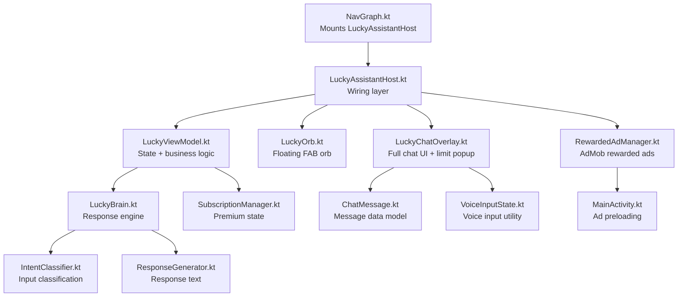
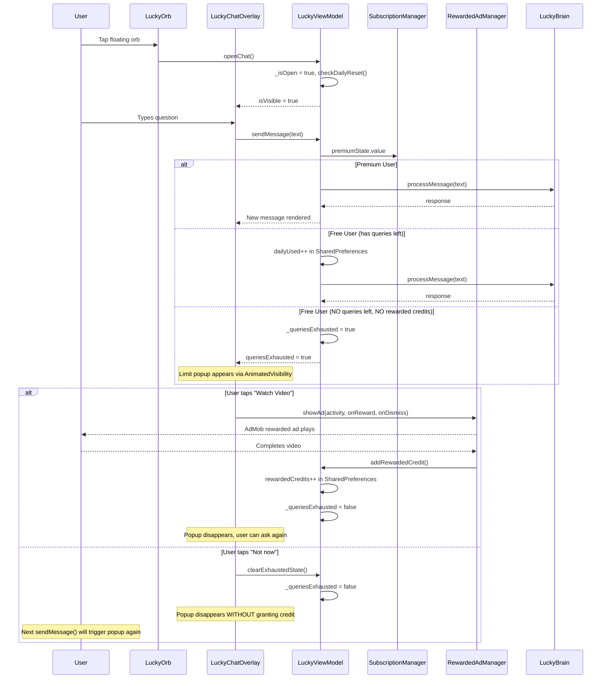
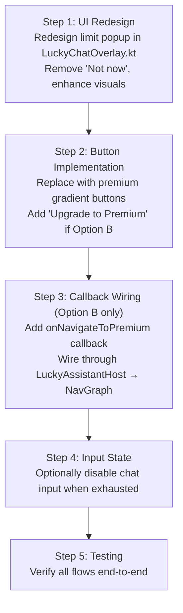

# LOCKLET PRO — LUCKY AI LIMIT SCREEN FORENSIC DIAGNOSIS

## Executive Summary

The Lucky AI limit popup is a lightweight inline `AnimatedVisibility` panel embedded inside `LuckyChatOverlay.kt`. It appears when `queriesExhausted == true` and displays two buttons: **"Not now"** (dismisses popup, does NOT grant credit) and **"Watch Video"** (triggers rewarded ad → grants 1 extra credit). The architecture is clean, isolated, and highly safe for UI modification. Both Option A (Watch Video only) and Option B (Watch Video + Upgrade to Premium) can be implemented with changes confined to **2 files** (`LuckyChatOverlay.kt` and `LuckyAssistantHost.kt`) with zero risk to business logic.

---

## 1. Current Lucky AI Architecture

### File Dependency Map



### Complete File Inventory

| File | Path | Role |
|------|------|------|
| [LuckyChatOverlay.kt](file:///d:/Antigravity%20Projects/tests/LockletPro/app/src/main/java/com/lockletpro/features/lucky/ui/LuckyChatOverlay.kt) | `features/lucky/ui/` | Full chat screen UI including the limit popup (lines 219-263) |
| [LuckyAssistantHost.kt](file:///d:/Antigravity%20Projects/tests/LockletPro/app/src/main/java/com/lockletpro/features/lucky/ui/LuckyAssistantHost.kt) | `features/lucky/ui/` | Wiring layer — connects ViewModel to UI, binds ad callbacks |
| [LuckyOrb.kt](file:///d:/Antigravity%20Projects/tests/LockletPro/app/src/main/java/com/lockletpro/features/lucky/ui/LuckyOrb.kt) | `features/lucky/ui/` | Floating neon orb FAB |
| [LuckyViewModel.kt](file:///d:/Antigravity%20Projects/tests/LockletPro/app/src/main/java/com/lockletpro/features/lucky/viewmodel/LuckyViewModel.kt) | `features/lucky/viewmodel/` | State management, daily counter, credit system |
| [LuckyBrain.kt](file:///d:/Antigravity%20Projects/tests/LockletPro/app/src/main/java/com/lockletpro/features/lucky/engine/LuckyBrain.kt) | `features/lucky/engine/` | Message processing coordinator |
| [IntentClassifier.kt](file:///d:/Antigravity%20Projects/tests/LockletPro/app/src/main/java/com/lockletpro/features/lucky/engine/IntentClassifier.kt) | `features/lucky/engine/` | NLP-style keyword intent classification |
| [ResponseGenerator.kt](file:///d:/Antigravity%20Projects/tests/LockletPro/app/src/main/java/com/lockletpro/features/lucky/engine/ResponseGenerator.kt) | `features/lucky/engine/` | Generates response text per intent |
| [LuckyIntent.kt](file:///d:/Antigravity%20Projects/tests/LockletPro/app/src/main/java/com/lockletpro/features/lucky/engine/LuckyIntent.kt) | `features/lucky/engine/` | Enum of all classified intents |
| [ChatMessage.kt](file:///d:/Antigravity%20Projects/tests/LockletPro/app/src/main/java/com/lockletpro/features/lucky/model/ChatMessage.kt) | `features/lucky/model/` | Data class for chat messages |
| [VoiceInputState.kt](file:///d:/Antigravity%20Projects/tests/LockletPro/app/src/main/java/com/lockletpro/features/lucky/utils/VoiceInputState.kt) | `features/lucky/utils/` | Voice input composable utility |
| [RewardedAdManager.kt](file:///d:/Antigravity%20Projects/tests/LockletPro/app/src/main/java/com/lockletpro/ads/RewardedAdManager.kt) | `ads/` | AdMob rewarded ad singleton |
| [SubscriptionManager.kt](file:///d:/Antigravity%20Projects/tests/LockletPro/app/src/main/java/com/lockletpro/manager/SubscriptionManager.kt) | `manager/` | Cashfree premium state management |
| [NavGraph.kt](file:///d:/Antigravity%20Projects/tests/LockletPro/app/src/main/java/com/lockletpro/ui/navigation/NavGraph.kt) | `ui/navigation/` | Mounts LuckyAssistantHost on eligible routes |
| [Screen.kt](file:///d:/Antigravity%20Projects/tests/LockletPro/app/src/main/java/com/lockletpro/ui/navigation/Screen.kt) | `ui/navigation/` | Route definitions including `Screen.Subscription` |
| [MainActivity.kt](file:///d:/Antigravity%20Projects/tests/LockletPro/app/src/main/java/com/lockletpro/MainActivity.kt) | root | Preloads rewarded ad via `RewardedAdManager.loadAd(this)` (line 174) |

---

## 2. Complete User Flow



---

## 3. Target UI Components

### The Limit Popup

**Location:** [LuckyChatOverlay.kt lines 219–263](file:///d:/Antigravity%20Projects/tests/LockletPro/app/src/main/java/com/lockletpro/features/lucky/ui/LuckyChatOverlay.kt#L219-L263)

**Structure:**
```
AnimatedVisibility(visible = queriesExhausted)
└── Surface (ComposerNavy, RoundedCornerShape 16dp, BorderAccent border)
    └── Column (16dp padding, centered)
        ├── Text: "You have used today's free Lucky AI questions."
        ├── Text: "Watch a short video to unlock 1 extra question."
        └── Row (SpaceEvenly)
            ├── TextButton: "Not now"  → calls onDismissOffer
            └── Button: "Watch Video" → calls onWatchVideo
```

**Composable Signature:**
```kotlin
fun LuckyChatOverlay(
    isVisible: Boolean,
    messages: List<ChatMessage>,
    isTyping: Boolean,
    queriesExhausted: Boolean = false,     // ← controls popup visibility
    onClose: () -> Unit,
    onSendMessage: (String) -> Unit,
    onWatchVideo: () -> Unit = {},          // ← rewarded ad trigger
    onDismissOffer: () -> Unit = {}         // ← dismiss (bypass) trigger
)
```

### Callback Wiring

In [LuckyAssistantHost.kt lines 42–56](file:///d:/Antigravity%20Projects/tests/LockletPro/app/src/main/java/com/lockletpro/features/lucky/ui/LuckyAssistantHost.kt#L42-L56):

| Callback | Binding |
|----------|---------|
| `onWatchVideo` | `RewardedAdManager.showAd(activity, onUserEarnedReward = { viewModel.addRewardedCredit() }, onAdDismissed = {})` |
| `onDismissOffer` | `viewModel.clearExhaustedState()` |

---

## 4. Rewarded Ad Flow Analysis

### How Rewarded Ads Currently Work

1. **Preloading:** `RewardedAdManager.loadAd(context)` is called in [MainActivity.kt line 174](file:///d:/Antigravity%20Projects/tests/LockletPro/app/src/main/java/com/lockletpro/MainActivity.kt#L174). This loads an AdMob `RewardedAd` asynchronously.

2. **Showing:** When user taps "Watch Video", `RewardedAdManager.showAd(activity, onReward, onDismissed)` is called.
   - If ad is not ready (`rewardedAd == null`), `onAdDismissed()` fires immediately — **no credit is granted**.
   - If ad is ready, it shows the fullscreen ad.

3. **Reward Callback:** `ad.show(activity) { rewardItem -> onUserEarnedReward() }` fires when the user **completes** the video. This triggers `viewModel.addRewardedCredit()`.

4. **Credit Grant:** `addRewardedCredit()` increments `KEY_REWARDED_CREDITS` in SharedPreferences by 1 and sets `_queriesExhausted = false`.

5. **Auto-reload:** After the ad is dismissed (whether reward earned or not), `loadAd(activity)` is called to preload the next ad.

### Key Verification

> ✅ **Confirmed:** "Watch Video" → completes ad → `addRewardedCredit()` → grants exactly 1 extra question.
>
> The next `sendMessage()` call will consume the rewarded credit (line 98-99 in LuckyViewModel).

---

## 5. Premium Navigation Analysis

### Does Premium Purchase Navigation Already Exist?

**YES.** The full Cashfree premium purchase flow is already wired:

| Element | Location |
|---------|----------|
| Route definition | `Screen.Subscription` → `"subscription"` in [Screen.kt line 69](file:///d:/Antigravity%20Projects/tests/LockletPro/app/src/main/java/com/lockletpro/ui/navigation/Screen.kt#L69) |
| Composable | `SubscriptionScreen` at [NavGraph.kt lines 743–770](file:///d:/Antigravity%20Projects/tests/LockletPro/app/src/main/java/com/lockletpro/ui/navigation/NavGraph.kt#L743-L770) |
| Existing usage | Profile screen navigates via `onNavigateToSubscription = { navController.navigate(Screen.Subscription.route) }` at [NavGraph.kt line 386](file:///d:/Antigravity%20Projects/tests/LockletPro/app/src/main/java/com/lockletpro/ui/navigation/NavGraph.kt#L386) |
| Lucky AI visibility | Lucky orb is already visible **on** the subscription route (line 907) |

### Can "Upgrade to Premium" Reuse Existing Navigation?

**YES — but with a caveat.** `LuckyAssistantHost` does not currently have a `navController` reference. To navigate to the subscription screen, the implementation would need to:

- **Option A (Preferred):** Add an `onNavigateToPremium: () -> Unit = {}` callback to both `LuckyChatOverlay` and `LuckyAssistantHost`, and wire it in `NavGraph.kt` to `navController.navigate(Screen.Subscription.route)`.
- **Option B:** Pass `navController` directly into `LuckyAssistantHost` (less clean, breaks the composable's encapsulation).

---

## 6. Dependency Analysis — What Happens if "Not Now" is Removed

### Current "Not Now" Behavior

`onDismissOffer` → `viewModel.clearExhaustedState()` → `_queriesExhausted.value = false` → popup hides.

The user can then type again, but `sendMessage()` will **immediately re-trigger** the popup because the credit counters haven't changed. So "Not Now" is a **temporary** dismissal — the user cannot get another answer by dismissing.

### Effects of Removing "Not Now"

| Area | Impact | Severity |
|------|--------|----------|
| **Dialog dismiss** | Popup stays visible until ad is watched or chat is closed | ✅ Intended behavior |
| **Back handling** | Chat `onClose` still works (close button in header) | ✅ No impact |
| **Navigation** | Unchanged — close button or system back still exits chat | ✅ No impact |
| **State** | `_queriesExhausted` stays `true` until `addRewardedCredit()` or `closeChat()/openChat()` | ⚠️ See note below |
| **Animation** | `AnimatedVisibility` stays visible — no animation issue | ✅ No impact |
| **Lifecycle** | No lifecycle dependency | ✅ No impact |
| **ViewModel** | `clearExhaustedState()` becomes unused but can stay for future use | ✅ No impact |
| **Compose state** | Clean — no stale state risk | ✅ No impact |
| **Ad callbacks** | Completely independent | ✅ No impact |
| **Premium state** | Independent of dismiss flow | ✅ No impact |
| **Question counter** | Counter logic is in `sendMessage()`, not in dismiss | ✅ No impact |

> [!IMPORTANT]
> **Edge case:** If the user **closes** the chat overlay (via the X button) while `queriesExhausted == true`, then reopens it, the popup will still be visible because `_queriesExhausted` was never cleared. `openChat()` calls `checkDailyReset()` but does NOT clear the exhausted state. This is **current behavior** and is not introduced by removing "Not Now" — the user already sees the popup again on reopen.

---

## 7. Safety Analysis

| System | Affected? | Explanation |
|--------|-----------|-------------|
| AI logic (LuckyBrain, IntentClassifier, ResponseGenerator) | ❌ No | Completely isolated in `engine/` package |
| Reward logic (addRewardedCredit, credit counters) | ❌ No | ViewModel logic stays unchanged |
| Premium logic (SubscriptionManager) | ❌ No | Only `premiumState.value` is read in ViewModel |
| Cashfree | ❌ No | Lives in `SubscriptionManager`, never touched by Lucky UI |
| Firebase | ❌ No | Auth used only by SubscriptionManager |
| Supabase | ❌ No | Used only by SubscriptionManager and repositories |
| OCR | ❌ No | Completely separate feature |
| Authentication | ❌ No | No auth dependency in Lucky AI |
| Navigation (NavGraph) | ⚠️ Minor | Only if Option B is chosen (needs new callback wiring) |
| Chat history | ❌ No | Messages list is independent |
| Database | ❌ No | Lucky uses SharedPreferences, not database |
| Ads SDK | ❌ No | `RewardedAdManager` API stays exactly the same |
| Daily counter | ❌ No | Counter logic in `sendMessage()` is not touched |
| SharedPreferences | ❌ No | Read/write logic stays in ViewModel |

---

## 8. Risk Assessment

### Low Risk ✅
- Removing "Not now" button from UI (pure composable removal)
- Replacing buttons with premium-styled versions
- Adding glassmorphic card, animated icon, gradient buttons
- Adding entrance animations to the limit popup
- Redesigning text hierarchy and spacing

### Medium Risk ⚠️
- Adding `onNavigateToPremium` callback through the composable chain (requires touching `LuckyChatOverlay.kt` parameter list, `LuckyAssistantHost.kt` wiring, and `NavGraph.kt` callback binding)
- Closing the chat overlay before navigating to subscription screen (needs careful state management so the chat doesn't lose its messages)

### High Risk ❌
- Modifying `LuckyViewModel` credit logic — **DO NOT**
- Modifying `RewardedAdManager` — **DO NOT**
- Modifying `SubscriptionManager` — **DO NOT**
- Modifying `sendMessage()` flow — **DO NOT**

---

## 9. UI Improvement Opportunities

> [!NOTE]
> These are suggestions only. No implementation.

### For the Limit Popup

| Improvement | Description |
|-------------|-------------|
| **Glassmorphic card** | Replace plain `Surface` with glass-effect card using `Color.White.copy(alpha = 0.08f)` background and gradient border, matching the Locklet Pro design system |
| **Animated lock icon** | Add a lock/shield icon with pulsing glow animation at the top of the popup |
| **Gradient "Watch Video" button** | Replace plain `Button` with the app's `GradientButton` or a custom gradient `SourceButton`-style button |
| **Premium CTA button** | Add "Upgrade to Premium" with a gold/diamond gradient (Option B only) |
| **Smooth entrance animation** | Replace the default `AnimatedVisibility` with custom slide-up + fade + scale entrance |
| **Question progress indicator** | Show "3/3 questions used" as a small progress bar or counter |
| **Countdown timer** | Show time remaining until daily reset (optional, advanced) |
| **Reward animation** | Brief confetti or glow animation when a rewarded credit is added |
| **Premium badge** | Show a small "∞ Unlimited" badge for premium users (contextual upsell) |
| **Better typography** | Use `headlineSmall` + `bodyMedium` with the existing Aurora palette instead of plain `14sp`/`13sp` |
| **Modern spacing** | 24dp internal padding, 16dp between elements instead of current 4dp/12dp |
| **Breathing animation** | Subtle scale/alpha breathing on the lock icon to draw attention |
| **Disable input field** | Grey out the chat input when exhausted so the user can't type messages that will just re-trigger the popup |

---

## 10. Implementation Roadmap

### Production-Safe Order



### Step-by-Step Detail

| Step | File(s) | Change | Risk |
|------|---------|--------|------|
| **1. Popup UI redesign** | `LuckyChatOverlay.kt` (lines 219-263) | Replace the popup Surface/Column/Row with a premium glassmorphic card. Remove "Not now" TextButton. Add animated lock icon, better typography, gradient background. | Low |
| **2. Watch Video button** | `LuckyChatOverlay.kt` | Replace plain `Button` with gradient-styled button matching Locklet Pro design language. Keep `onClick = onWatchVideo`. | Low |
| **3a. (Option A) Single button** | `LuckyChatOverlay.kt` | Only render "Watch Video" button. Remove `onDismissOffer` from the popup UI. Keep the callback in the composable signature for backward compatibility. | Low |
| **3b. (Option B) Two buttons** | `LuckyChatOverlay.kt` + `LuckyAssistantHost.kt` + `NavGraph.kt` | Add `onNavigateToPremium: () -> Unit = {}` parameter. Render two buttons: "Watch Video" + "Upgrade to Premium". Wire in NavGraph: `onNavigateToPremium = { viewModel.closeChat(); navController.navigate(Screen.Subscription.route) }` | Medium |
| **4. Input disabling** | `LuckyChatOverlay.kt` | When `queriesExhausted`, make the `OutlinedTextField` read-only and grey out the send button. | Low |
| **5. Testing** | N/A | Manual verification of all flows (see checklist below). | — |

### Testing Checklist

- [ ] Open Lucky AI → type 3 questions → verify popup appears after 3rd
- [ ] Popup: "Not now" button is **gone** (or only shows if Option A)
- [ ] Tap "Watch Video" → rewarded ad plays → credit granted → popup disappears → can ask 1 more question
- [ ] (Option B) Tap "Upgrade to Premium" → chat closes → navigates to Subscription screen
- [ ] (Option B) Complete Cashfree purchase → return → `premiumState = true` → Lucky AI is unlimited
- [ ] Close chat while exhausted → reopen → popup reappears (expected)
- [ ] Premium users never see the popup
- [ ] Ad not ready: "Watch Video" tap gracefully handles it (current: `onAdDismissed()` fires)
- [ ] All existing chat history preserved across popup interactions
- [ ] No crashes, no compile errors, no memory leaks

---

## Target Files Summary

### Files to Modify

| File | Change Type |
|------|-------------|
| [LuckyChatOverlay.kt](file:///d:/Antigravity%20Projects/tests/LockletPro/app/src/main/java/com/lockletpro/features/lucky/ui/LuckyChatOverlay.kt) | Redesign popup UI (lines 219-263), remove "Not now" button, add premium styling |
| [LuckyAssistantHost.kt](file:///d:/Antigravity%20Projects/tests/LockletPro/app/src/main/java/com/lockletpro/features/lucky/ui/LuckyAssistantHost.kt) | (Option B only) Add `onNavigateToPremium` callback wiring |
| [NavGraph.kt](file:///d:/Antigravity%20Projects/tests/LockletPro/app/src/main/java/com/lockletpro/ui/navigation/NavGraph.kt) | (Option B only) Wire `onNavigateToPremium` to `navController.navigate(Screen.Subscription.route)` at line 911-913 |

### Files NOT to Modify

| File | Reason |
|------|--------|
| `LuckyViewModel.kt` | Business logic — daily counter, credits, exhausted state |
| `RewardedAdManager.kt` | Ad SDK integration |
| `SubscriptionManager.kt` | Cashfree payment flow |
| `LuckyBrain.kt` | AI response engine |
| `IntentClassifier.kt` | Intent classification |
| `ResponseGenerator.kt` | Response generation |
| `LuckyIntent.kt` | Intent enum |
| `ChatMessage.kt` | Data model |
| `LuckyOrb.kt` | Floating button (unrelated) |
| `VoiceInputState.kt` | Voice utility (unrelated) |
| `MainActivity.kt` | Ad preloading (unchanged) |
| `Screen.kt` | Route definitions (unchanged) |

---

## Production Readiness Notes

> [!TIP]
> **Option A** (Watch Video only) requires changes to **1 file** only (`LuckyChatOverlay.kt`) and carries the lowest possible risk.

> [!IMPORTANT]
> **Option B** (Watch Video + Upgrade to Premium) requires changes to **3 files** but enables premium upsell directly from the limit state, which is a high-conversion moment. The `navController` wiring is the only "medium risk" step and follows the exact same pattern already used by the Profile screen's subscription navigation.

> [!WARNING]
> If "Not now" is removed AND the chat input is NOT disabled: the user can still type and press send, which will immediately re-trigger `queriesExhausted = true` from `sendMessage()`. This is harmless but could feel jarring. Consider disabling the input field when exhausted for a polished UX.
