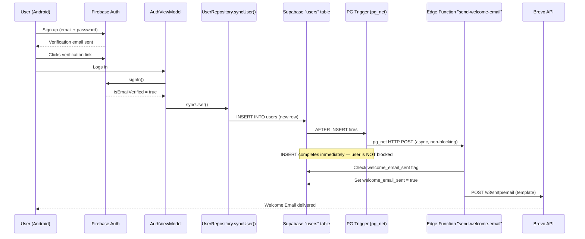

# Brevo Welcome Email — Implementation Walkthrough

## 1. Architecture Summary



> [!IMPORTANT]
> The database trigger uses `pg_net` for a fully **asynchronous** HTTP call. The user's INSERT transaction completes instantly — the email sending happens in the background. If Brevo is down, the user flow is unaffected.

---

## 2. Files Created

| # | File | Purpose |
|---|------|---------|
| 1 | [20260623000000_welcome_email_trigger.sql](file:///d:/Antigravity%20Projects/tests/LockletPro/supabase/migrations/20260623000000_welcome_email_trigger.sql) | SQL migration: column + trigger function + trigger |
| 2 | [send-welcome-email/index.ts](file:///d:/Antigravity%20Projects/tests/LockletPro/supabase/functions/send-welcome-email/index.ts) | Supabase Edge Function: Brevo API integration |

## 3. Files Modified

| # | File | Changes |
|---|------|---------|
| — | **None** | Zero existing files were modified |

> [!TIP]
> No Android files, no existing Edge Functions, no existing migrations, and no existing Supabase client code was touched.

---

## 4. SQL Migration Details

**File**: [20260623000000_welcome_email_trigger.sql](file:///d:/Antigravity%20Projects/tests/LockletPro/supabase/migrations/20260623000000_welcome_email_trigger.sql)

### What it does:
1. **Adds column** `welcome_email_sent BOOLEAN DEFAULT FALSE NOT NULL` to `public.users`
   - Default `FALSE` — existing users won't receive retroactive emails
   - `NOT NULL` constraint prevents ambiguous state
2. **Enables `pg_net`** extension for async HTTP calls from Postgres
3. **Creates trigger function** `handle_new_user_welcome_email()`:
   - Reads Supabase URL and service role key from the Vault
   - Builds the Edge Function URL and JSON payload
   - Fires `net.http_post()` asynchronously (non-blocking)
   - Catches ALL exceptions — never blocks the INSERT
4. **Creates trigger** `on_new_user_send_welcome_email`:
   - `AFTER INSERT` on `public.users` — **only INSERT, never UPDATE/DELETE**
   - `FOR EACH ROW` — fires once per new user

### Schema impact on existing `SupabaseUser` model:
The Android `SupabaseUser` Kotlin data class uses `ignoreUnknownKeys = true` in its JSON serializer (see [SupabaseClientProvider.kt](file:///d:/Antigravity%20Projects/tests/LockletPro/app/src/main/java/com/lockletpro/data/SupabaseClientProvider.kt#L33)). The new `welcome_email_sent` column will be silently ignored by the Android client. **Zero impact.**

---

## 5. Edge Function Code

**File**: [send-welcome-email/index.ts](file:///d:/Antigravity%20Projects/tests/LockletPro/supabase/functions/send-welcome-email/index.ts)

### Flow:
1. **Validate** `BREVO_API_KEY` is present in secrets
2. **Parse** trigger payload (`firebase_uid`, `email`, `name`)
3. **Idempotency check** — query `welcome_email_sent` flag, skip if `true`
4. **Optimistic lock** — set `welcome_email_sent = true` with `WHERE welcome_email_sent = false` (atomic)
5. **Call Brevo** `POST /v3/smtp/email` with template ID and params
6. **On failure** — revert `welcome_email_sent` to `false` so retries work
7. **Always returns HTTP 200** — prevents pg_net retry storms

### Security:
- `BREVO_API_KEY` read exclusively from `Deno.env.get("BREVO_API_KEY")`
- Supabase service role key used only server-to-server
- No CORS headers needed (not called from browser/app)

---

## 6. Deployment Commands

### Step 1: Deploy the Edge Function
```bash
supabase functions deploy send-welcome-email --project-ref <YOUR_PROJECT_REF>
```

### Step 2: Run the SQL Migration
Execute the migration via the Supabase Dashboard SQL Editor or CLI:
```bash
supabase db push --project-ref <YOUR_PROJECT_REF>
```
Or run the SQL manually in the Dashboard → SQL Editor by pasting the contents of [20260623000000_welcome_email_trigger.sql](file:///d:/Antigravity%20Projects/tests/LockletPro/supabase/migrations/20260623000000_welcome_email_trigger.sql).

> [!IMPORTANT]
> **Deploy the Edge Function FIRST**, then run the migration. This ensures the trigger has a target endpoint when it fires.

### Step 3: Configure Edge Function (if not already done)

Before deploying, update the two `TODO` items in the Edge Function:

| Setting | Line | What to set |
|---------|------|-------------|
| `BREVO_TEMPLATE_ID` | Line 13 | Your actual Brevo template ID (integer) |
| `SENDER_EMAIL` | Line 15 | Your verified Brevo sender email |
| `SENDER_NAME` | Line 16 | Your display sender name |

> [!WARNING]
> The `BREVO_API_KEY` is already in Supabase Secrets. The `SUPABASE_URL` and `SUPABASE_SERVICE_ROLE_KEY` are automatically available to all Edge Functions. No additional secret configuration is needed.

---

## 7. Testing Checklist

### Pre-deployment validation:
- [ ] Confirm `BREVO_API_KEY` is in Supabase Edge Function Secrets
- [ ] Confirm `BREVO_TEMPLATE_ID` in the Edge Function matches your actual template
- [ ] Confirm `SENDER_EMAIL` is a verified sender in Brevo

### Post-deployment tests:
- [ ] **New user signup**: Create a new test account → verify email → login → check inbox for welcome email
- [ ] **Duplicate prevention**: Log out and log back in → confirm no second welcome email is sent
- [ ] **Existing user safety**: Verify that existing users in the `users` table have `welcome_email_sent = FALSE` and do NOT receive emails (trigger is `AFTER INSERT` only, not UPDATE)
- [ ] **Edge function logs**: Check Supabase Dashboard → Edge Functions → `send-welcome-email` → Logs for success/error messages
- [ ] **Google Sign-In**: Sign up via Google → confirm welcome email is sent (syncUser() also inserts for Google users)

### Regression tests (should all pass without changes):
- [ ] Login with existing account works normally
- [ ] Firebase email verification flow works
- [ ] Cashfree subscription purchase works
- [ ] Premium status displays correctly
- [ ] OCR scanning works
- [ ] Document upload/download works
- [ ] Profile editing works
- [ ] Subscription history loads

---

## 8. Rollback Procedure

If anything goes wrong, the entire system can be rolled back in under 60 seconds:

### Emergency rollback (SQL):
```sql
-- 1. Remove the trigger (stops all future emails immediately)
DROP TRIGGER IF EXISTS on_new_user_send_welcome_email ON public.users;

-- 2. Remove the trigger function
DROP FUNCTION IF EXISTS public.handle_new_user_welcome_email();

-- 3. Remove the column (optional — safe to leave)
ALTER TABLE public.users DROP COLUMN IF EXISTS welcome_email_sent;
```

### Emergency rollback (Edge Function):
```bash
# Delete the edge function (optional — trigger removal above is sufficient)
supabase functions delete send-welcome-email --project-ref <YOUR_PROJECT_REF>
```

> [!TIP]
> Simply dropping the trigger in Step 1 is sufficient for an instant rollback. The Edge Function becomes unreachable, and the column is harmlessly ignored by the Android app.

---

## 9. Security Audit Report

| Check | Status | Detail |
|-------|--------|--------|
| Brevo API key in APK | ✅ PASS | Key is only in Supabase Edge Function Secrets |
| Brevo API key in BuildConfig | ✅ PASS | Not present |
| Brevo API key in SharedPreferences | ✅ PASS | Not present |
| Brevo API key in Firebase | ✅ PASS | Not present |
| Brevo API key in Supabase tables | ✅ PASS | Not present — only in Deno.env |
| Brevo API key hardcoded | ✅ PASS | Read via `Deno.env.get("BREVO_API_KEY")` |
| Edge Function auth | ✅ PASS | Called by pg_net with service role key |
| CORS exposure | ✅ PASS | No CORS headers — not callable from browser |
| SQL injection | ✅ PASS | Parameterized via `jsonb_build_object` |
| Client-side trigger | ✅ PASS | Trigger fires server-side only |

---

## 10. Risk Assessment

| Risk | Level | Mitigation |
|------|-------|------------|
| Welcome email not sent (Brevo outage) | **LOW** | Flag reverts to `false`; manual re-trigger possible |
| Duplicate welcome emails | **NONE** | Optimistic lock with `WHERE welcome_email_sent = false` |
| User INSERT blocked/delayed | **NONE** | `pg_net` is fully async — INSERT returns immediately |
| Existing users get emails | **NONE** | Trigger is `AFTER INSERT` only; column defaults to `FALSE` |
| Android app crash | **NONE** | Zero Android code changes |
| Subscription system affected | **NONE** | Zero changes to Cashfree Edge Functions or SubscriptionManager |
| Premium logic affected | **NONE** | Zero changes to premium state management |
| Firebase auth affected | **NONE** | Zero changes to AuthRepository or AuthViewModel |
| OCR affected | **NONE** | Zero changes to scanner/OCR code |

---

## 11. Confirmation of Zero Impact on Existing Systems

| System | Modified? | Evidence |
|--------|-----------|----------|
| `AuthViewModel.kt` | ❌ NO | Not touched |
| `AuthRepository.kt` | ❌ NO | Not touched |
| `UserRepository.kt` | ❌ NO | Not touched |
| `SupabaseUser.kt` | ❌ NO | `ignoreUnknownKeys = true` handles new column |
| `SubscriptionManager.kt` | ❌ NO | Not touched |
| `create-cashfree-order/index.ts` | ❌ NO | Not touched |
| `verify-payment/index.ts` | ❌ NO | Not touched |
| `cashfree-webhook/index.ts` | ❌ NO | Not touched |
| `get-subscription-history/index.ts` | ❌ NO | Not touched |
| `get-user-documents/index.ts` | ❌ NO | Not touched |
| Firebase Auth flow | ❌ NO | Not touched |
| Email verification flow | ❌ NO | Not touched |
| OCR/Scanner features | ❌ NO | Not touched |
| Document storage/sync | ❌ NO | Not touched |
| Premium/subscription logic | ❌ NO | Not touched |
| Existing SQL migrations | ❌ NO | New migration only — additive |
