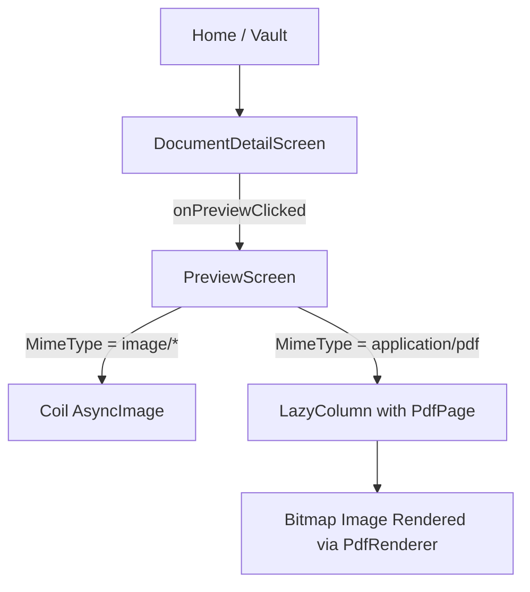

# Locklet Pro – Document Viewer Zoom Forensic Audit

## 1. Viewer Architecture Diagram

## 2. Image Rendering Flow

*   **Target File:** `PreviewScreen.kt`
*   **State Management:** `PreviewViewModel.kt`
*   **Loading Mechanism:**
    1.  ViewModel downloads document from Supabase to `context.cacheDir` (e.g., `preview_id_filename`).
    2.  Sets `PreviewState.Success(file, mimeType)`.
    3.  **Images:** Rendered via Coil's `AsyncImage` directly from the local file.
    4.  **PDFs:** Rendered via a custom `LazyColumn`. `PdfRenderer` converts each page to a `Bitmap` (scaled at 1.5x), which is then displayed via Compose `Image`.
*   **Caching:**
    *   **Disk:** The decrypted file is cached in the local cache directory. Coil also maintains its own disk cache for images.
    *   **Memory:** Coil handles memory caching for images. For PDFs, the bitmap is held in a `remember` block per visible `PdfPage` and correctly recycled in `onDispose`.

## 3. Current Gesture Support

*   **Search Results:** `detectTransformGestures` is completely absent from the project. `Modifier.transformable` is currently only used in `ManualCropScreen.kt` for the scanner.
*   **Status in Viewer:** **None.** The `PreviewScreen` currently uses `ContentScale.Fit` with no gesture modifiers attached to either `AsyncImage` or the PDF `Image`.

## 4. Zoom Integration Points

The integration must target two distinct rendering paths within `PreviewScreen.kt`:

1.  **Image Path (Line 111):** Wrapping the `AsyncImage` composable.
2.  **PDF Path (Line 207):** Wrapping the `Image` composable inside `PdfPage`.

*Since PDFs are rendered inside a `LazyColumn`, applying pan/zoom gestures requires intercepting touch events carefully so as not to break vertical scrolling when zoomed out.*

## 5. Risk Analysis: Safest Approach

| Option | Approach | Risk Level | Notes |
| :--- | :--- | :--- | :--- |
| A | Wrap existing components in a custom `ZoomableBox` using `detectTransformGestures` | **LOW** | **(Recommended)** Extremely safe. Leaves existing `AsyncImage` and `PdfRenderer` logic untouched. |
| B | `Modifier.transformable` | **MEDIUM** | Less flexible for combining with `detectTapGestures` (for double-tap zoom). |
| C | Add new 3rd Party Library (e.g., Telephoto) | **HIGH** | Violates "No Dependency Additions" constraint. |

## 6. Target Files

1.  `com.lockletpro.ui.screens.document.PreviewScreen.kt` (Only injection point)
2.  `com.lockletpro.ui.components.ZoomableBox.kt` (New file to be created for the wrapper)

## 7. Exact Composables to Modify

*   Inside `PreviewScreen()` -> `PreviewViewModel.PreviewState.Success` block (where `AsyncImage` is called).
*   Inside `PdfPage()` -> Where the `Image(bitmap = ...)` is rendered.

## 8. Recommended Implementation Strategy

**Create a Reusable `ZoomableBox` Component:**

1.  Use `Modifier.pointerInput` with `detectTransformGestures` to calculate `scale`, `offsetX`, and `offsetY`.
2.  Use `Modifier.pointerInput` with `detectTapGestures` for `onDoubleTap`.
3.  Store state (`scale`, `offsetX`, `offsetY`) as `remember` variables inside the wrapper.
4.  Apply `Modifier.graphicsLayer` to the inner content to actually perform the transform visually without triggering recomposition overhead.
5.  **Wrap the Image:** Simply place the existing `AsyncImage` inside `ZoomableBox`.
6.  **Wrap the PDF Page:** Place the `Image` inside `PdfPage` inside `ZoomableBox`.

## 9. Pan & Boundary Constraints (Overscroll Protection)

When panning (dragging), the image must not fly off the screen.
*   **Math:** The maximum allowable translation is `(scale - 1) * dimension / 2`.
*   **Implementation:** The `offsetX` and `offsetY` values must be strictly clamped to `[-maxX, maxX]` and `[-maxY, maxY]` during the `detectTransformGestures` callback.

## 10. Memory and Crash Risks (OOM Risk)

*   **Large Images:** Coil automatically downsamples massive images to the display bounds, mitigating OOM crashes. Adding `graphicsLayer` scaling does *not* increase bitmap allocation size (it's purely a GPU render transform). **Risk: LOW.**
*   **Large PDFs:** `PdfPage` renders at 1.5x resolution. While zooming via `graphicsLayer` won't use more memory, the base bitmap is slightly larger. The `LazyColumn` effectively recycles off-screen pages via `onDispose { bitmap?.recycle() }`. **Risk: LOW/MEDIUM.**
*   **State Conflicts:** State must be localized. A global scale state would cause bugs (e.g., navigating away and back leaves the image zoomed). Local `remember` resets properly.

## 11. Build Safety Audit

*   **No Dependency Changes:** The `detectTransformGestures` and `graphicsLayer` modifiers are built into Compose UI Foundation.
*   **No Gradle Changes:** 0 modifications required.
*   **No Compose Version Changes:** Supported in all modern Compose versions.

## 12. Final Safety Score

**9.5 / 10 (Very High Safety)**
Because the viewer uses stateless Composables (`AsyncImage` and `Image`), introducing a wrapper `Box` with `graphicsLayer` transformation isolates the zoom logic entirely from the loading, authentication, and layout logic.

*(No code has been modified during this audit).*
